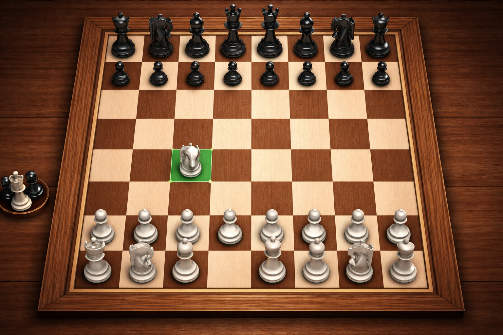

# ♟️ Chess Game using C++ & SFML

  

<h3 align="center">A Fully Object-Oriented Chess Game Built with C++ and SFML</h3>

  
  
  
  
  
  

---

## 📖 Overview  

This project is a **graphical Chess game built using C++ and SFML (Simple and Fast Multimedia Library)**.

It demonstrates strong **Object-Oriented Programming (OOP)** principles and real-time rendering using SFML.

---

## 🚀 Features  

- ♟️ Interactive 8×8 chessboard  
- 🧩 SFML-based piece rendering  
- 🧠 Full OOP architecture (inheritance + polymorphism)  
- ⚙️ Turn-based gameplay system  
- 🖥️ Mouse-based interaction  

---

## 🛠️ Tech Stack  

- C++  
- SFML  
- OOP Principles  
- CMake (optional build system)  

---

## 🧠 Core Concepts Used  

- Object-Oriented Programming  
- Inheritance & Polymorphism  
- Game Loop Design  
- Event Handling (Mouse/Keyboard)  
- Sprite & Texture Rendering  

---
